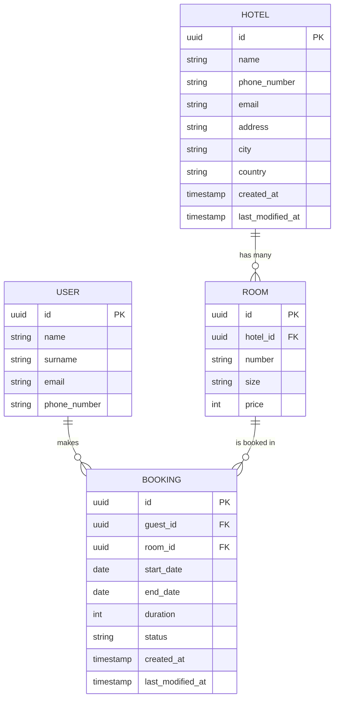

# Database Entity Relationship Diagram

The Mermaid block below renders the booking system entities and their relationships. Open this file in VS Code with the Mermaid Chart extension to visualize the ER diagram.

